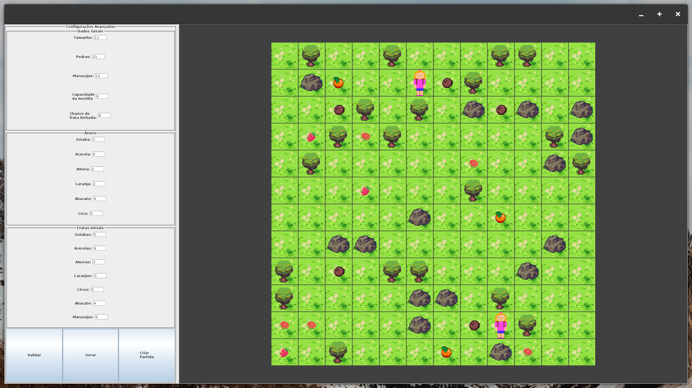

# Cata-Frutas 🍓🎮

Este repositório contém o projeto desenvolvido para a disciplina de **Programação Orientada a Objetos (POO)**.  
O projeto consistia na criação de um jogo chamado **"Cata-Frutas"**, cujo objetivo é coletar mais frutas maracujá que o seu oponente. 
O jogo foi desenvolvido aplicando os principais conceitos de POO, como:

- Encapsulamento
- Herança
- Polimorfismo
- Abstração

---

## 🚧 Status do Projeto

**Pausado** – O desenvolvimento do jogo está atualmente interrompido, podendo ser retomado futuramente.

---

## 🖼️ Screenshot

---

## 🛠️ Tecnologias Utilizadas

- Java
- Java Swing (para interface gráfica)
- Paradigma de Programação Orientada a Objetos

---

